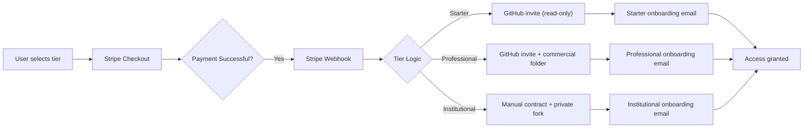
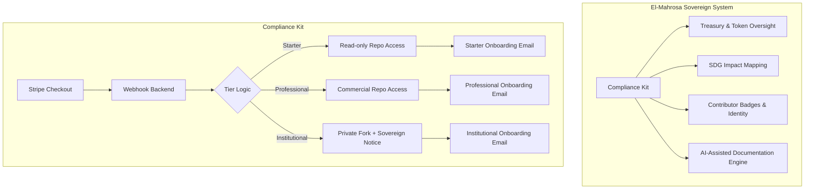

<!-- SPDX-License-Identifier: PolyForm-Internal-Use and TEOS-Sovereign-Notice -->
# 🏛 TEOS Egypt — Compliance Kit

[](LICENSES/PolyForm_Internal_Use.md)
[](https://www.python.org/)
[](https://github.com/Elmahrosa/TEOS-Egypt-Compliance-Kit/actions/workflows/ci.yml)

**AI‑Powered Compliance & Governance Infrastructure**  
*Sovereign‑Grade, Regulator‑Safe, Revenue‑Positive*

---

## 📖 Overview

The TEOS Egypt Compliance Kit provides **ready‑to‑use documentation frameworks** for banks, fintechs, and government pilots.  
It is **field‑tested** with live automation flows: Stripe → Webhook → GitHub → Onboarding Email.

> ⚠️ **Disclaimer:** Documentation frameworks only — not legal advice. Regulator‑neutral.

---

## ✨ Features

- **Compliance Templates:** AML, KYC, Internal Controls, Data Protection, Governance  
- **AI Prompt Engine:** Adjusts documentation tone for regulators, audits, and sandbox pilots  
- **Automation Scripts:** Stripe Checkout → GitHub collaborator invite → onboarding email  
- **Tiered Licensing:** Starter, Professional, Institutional with clear inheritance rules  
- **Integration Ready:** Plug‑and‑play with El‑Mahrosa Sovereign System  
- **Documentation & Diagrams:** Institutional brief, tier logic table, automation flow  

---

## 🛠️ Quick Start

### 1️⃣ Clone Repository
```bash
git clone https://github.com/Elmahrosa/TEOS-Egypt-Compliance-Kit.git
cd TEOS-Egypt-Compliance-Kit
```

### 2️⃣ Backend Setup
```bash
cd backend
pip install -r requirements.txt
cp .env.example .env
# Fill in Stripe, GitHub, and SendGrid credentials in .env
python app.py
```

### 3️⃣ Landing Page
- Deploy `landing/index.html` via Vercel, Netlify, or any static hosting  
- Ensure Stripe public key is set in `<script>` tag  

### 4️⃣ Automation Testing
```bash
cd automation-scripts
python stripe_create_session.py
python simulate_webhook.py
```

---

## 📊 Automation Flow Diagram



---

## 📊 El‑Mahrosa Integration Map



---

## 📊 Tier Logic Table

| Tier          | Payment Type    | GitHub Access            | License Type                      | Email Sent               |
| ------------- | --------------- | ------------------------ | --------------------------------- | ------------------------ |
| Starter       | $29/month       | Read‑only                | PolyForm Internal Use             | Starter onboarding       |
| Professional  | $499 one‑time   | Read + Commercial folder | PolyForm Commercial + attribution | Professional onboarding  |
| Institutional | Custom contract | Private fork             | TEOS Sovereign Notice             | Institutional onboarding |

---

## 🧩 Repository Structure

```text
TEOS-Egypt-Compliance-Kit/
├── landing/                 # Landing page and static assets
├── backend/                 # Flask API, Stripe webhooks, SendGrid
├── automation-scripts/      # Local test scripts
├── compliance-kits/         # AML, KYC, Governance templates
├── ai-prompts/              # AI prompt templates for regulators & audits
├── LICENSES/                # Tiered licenses
├── institutional/           # Institutional fork & deployment guides
├── docs/                    # One-page brief, tier table, diagrams
├── .github/                 # CI/CD, Issue/Pull templates
├── Dockerfile
├── docker-compose.yml
├── Makefile
└── .env.example
```

---

## ⚖️ Licensing
- **Starter:** PolyForm Internal Use  
- **Professional:** PolyForm Commercial — Attribution Required  
- **Institutional:** TEOS Sovereign Notice — Private Fork & White‑Label Options  

---

## 📚 Documentation
- `INSTITUTIONAL_BRIEF.md` — One‑page overview with diagram & tier logic  
- `ELMAHROSA_INTEGRATION_MAP.md` — How Compliance Kit integrates into sovereign system  
- `AUTOMATION_FLOW_DIAGRAM.mmd` — Mermaid diagram for Stripe → GitHub → Email  
- `TIER_LOGIC_TABLE.md` — Detailed access & licensing table  

---

## 🛡 Security & Conduct
- `SECURITY.md` — Vulnerability reporting and handling  
- `CODE_OF_CONDUCT.md` — Professional behavior for contributors  

---

## 🏗 CI/CD
- GitHub Actions configured for CI tests and linting  
- Dockerfile and docker‑compose included for containerized deployment  
- Makefile helpers for run, docker, and basic tests  

---

## 📦 Docker & PyPI

Pull the prebuilt Docker image:
```bash
docker pull teosegypt/compliance-kit:latest
docker run -p 3000:3000 teosegypt/compliance-kit
```

Install from PyPI:
```bash
pip install teosegypt-compliance-kit
```

---

## 📞 Contact / Institutional Access
- **Email:** contact@teosegypt.com  
- **Demo Requests:** Schedule via email or embedded form in landing page  
## 🇪🇬 TEOS Egypt Vision
Positioning Egypt as a **global exporter of governance infrastructure**, with compliance kits that are:  
- Ready‑to‑adopt  
- Legally defensible  
- Revenue‑tested  
```
